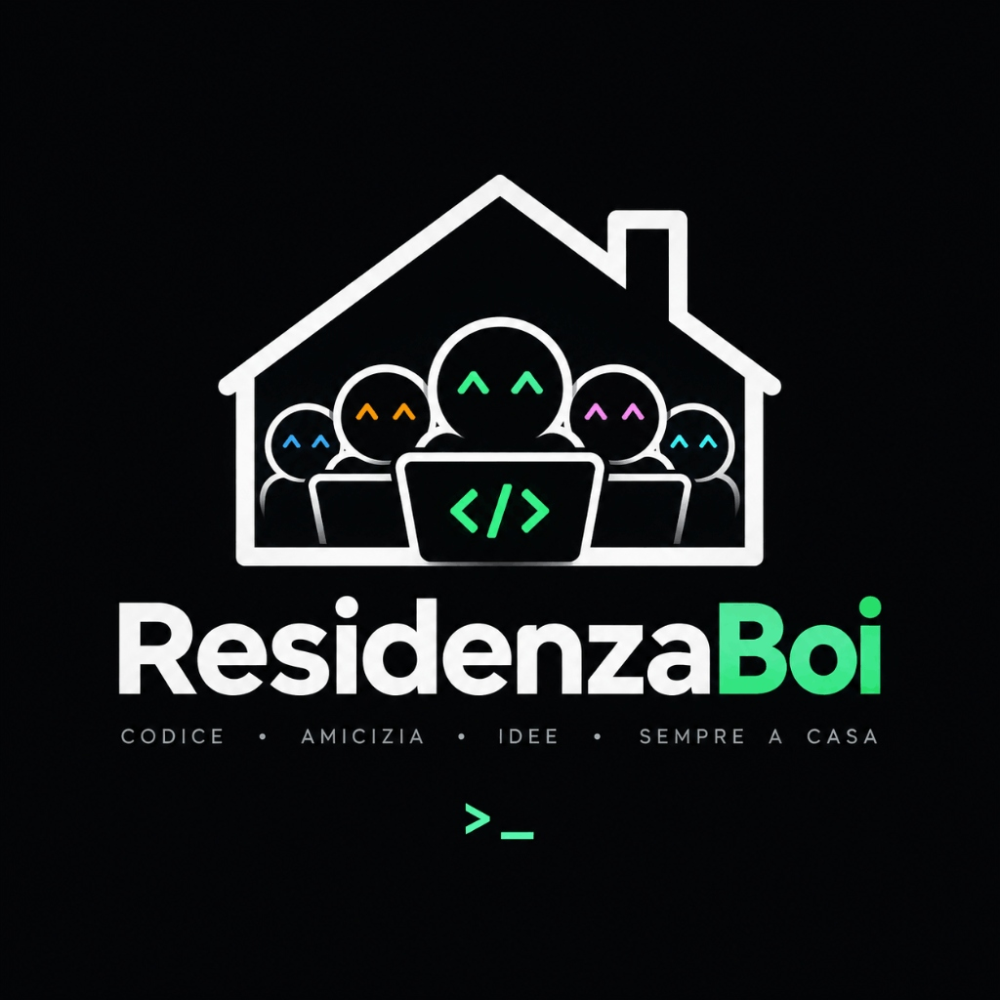

  

**Dalla vita in residenza a una community che gioca, compete e cresce insieme.**

 

---

## 💡 Cos'è ResidenzaBoi?

**ResidenzaBoi** nasce da un'idea semplice: trasformare il tradizionale registro del calcio della residenza **ELIS** in un'esperienza più completa, moderna e coinvolgente.

Dopo l'ultimo esame della sessione, invece di fermarci a riposare, abbiamo scelto di continuare a costruire. Abbiamo così iniziato a sviluppare una **piattaforma dedicata allo sport e alla vita della community ELIS**.

---

## 🏆 Un'unica piattaforma per lo sport in ELIS

| ⚽ **Calcio** | 🏀 **Basket** | 🏐 **Pallavolo** |
|:-------------:|:-------------:|:----------------:|
| Classifiche e risultati | Statistiche live | Tornei e sfide |

 

Per ogni sport offriamo un'esperienza chiara e completa:

> 📊 Classifiche aggiornate in tempo reale
>
> 📈 Statistiche individuali e di squadra
>
> 📋 Risultati e andamento delle partite
>
> 🔔 Notifiche direttamente nell'app
>
> 🤝 Uno spazio digitale pensato per favorire partecipazione e competizione sana

---

## 🫂 Più di un'app: una community

ResidenzaBoi non è soltanto uno strumento per registrare risultati. È un progetto **nato dalla community e per la community**, con l'obiettivo di rendere più semplice partecipare, seguire i propri progressi e vivere lo sport della residenza in modo ancora più coinvolgente.

> *Vogliamo creare un ambiente in cui ogni partita racconti qualcosa:*
> *la sfida, il gruppo, il miglioramento e il piacere di condividere un'esperienza.*

---

## 🛠️ Costruito insieme

Il progetto nasce dalla voglia di trasformare un'esigenza concreta in qualcosa di **utile, funzionale e bello da usare**.

Siamo all'inizio del percorso e stiamo costruendo ResidenzaBoi passo dopo passo, ascoltando la community e raccogliendo idee per migliorare continuamente.

---

## 🎯 Il nostro obiettivo

*Trasformare il registro delle partite in una piattaforma sportiva completa:*
*più funzionale, più connessa e soprattutto più vicina alle persone*
*che vivono la residenza ogni giorno.*

 

 

**ResidenzaBoi**

`>_`

